# **AXIS — Balancing robot**

***AXIS is a dual wheeled self-balancing robot built around an ESP32 and custom PCB!***

### **Project overview**

AXIS is a dual wheeled balancing robot, using a PID algorithm to keep its balance. The main microcontroller of the robot will be the ESP32. This enables the use of an Xbox controller for controlling the robot. Certain buttons on the controller will be mapped to the pid value settings so they can be changed on the fly, which should make the tuning process a lot easier.

As an additional feature that will be tested after the robot is already stable, 2 encoders that are already mounted on the motors will be added. Their data will be used in a second PID algorithm to hopefully get the robot to stay in a single place a lot easier. This feature is still completely optional and can easily be turned on by a button on the Xbox controller.

### **Goals**

The goal of this project is to become more familiarized with electronics to get a good foundation for future projects. And to grasp the basics of PCB-design.

The goal for the robot itself is to make it balance without jittering too much and to make it drivable via a controller.

### **Key components**

- Custom PCB to mount breakout boards on  
- 3D-printed frame  
- Custom code featuring a PID algorithm and bluetooth connection

### **PCB design**

This PCB features lots of female header pins to mount existing breakout boards onto. This framework makes for more reliable connections and pcb-design experience.  
To design the board I used KiCAD, a free open-source EDA.

The first step in the design process was coming up with the requirements and features of the board.  
These include:

- Measuring the robots angle reliably  
- Driving the motors  
- Being able to connect a small lcd display for easier status updates and eventually PID tuning  
- Accept power from a 7,2V NiMH battery  
- Have connectors for encoders

After setting these requirements, a schematic was designed before moving on to the actual tracing. This also enabled me to become even more familiarized with the design and the components.

With the schematic made, the pcb tracing was fairly easy. I paid special attention to the spacing between the female pin headers so the modules would fit properly. A ground plane was also added on the bottom of the PCB to make wiring easier. To disturb this plane as little as possible, I tried to lay out the PCB in such a way that I have almost no traces on the back side.  
The final PCB features:

- Headers for ESP32  
- Headers for IMU module (ICM20948)  
- Headers for motor driver (tb6612fng)  
- Headers for lcd display  
- Screw terminals for motors and encoders  
- Components to provide the right (and stable) voltages to all components  
- Protection components

### **3D-CAD**

For the CAD I used a program I’m fairly familiar with; Fusion 360.  
The frame is divided into 3 key parts:

- Motor mount  
- Bottom compartment  
- Top compartment

The motor mount is made so that the motor has no room to shake. This results in a weird internal shape because of the irregular shape of the motor with right angle gearbox. Additionally the motor is able to be secured with 4 screws via the motor mount cover. This cover also features some cooling slots (but I doubt I need them).

Further up, we have the bottom compartment of the head. This houses the custom PCB. Connections to the encoders and motors pass through the bottom to the motor mount.

Above, there is the top compartment of the head. Here is the battery, LCD screen and switch. Again, their connections will pass through the bottom to the compartment below.  
Finally a lid, secured with magnets for easy access, covers up the top.

### **Timeline**

What’s already been done:

- Full code (imu, controller, PID’s and motor)  
- PCB design in KiCad  
- IMU testing  
- Motor testing  
- PID testing (imu and motor)  
- 3D-CAD

What still needs to be done:

- 3D printing the frame  
- Ordering the PCB  
- Final assembly  
- PID tuning

### **Gallery**

##### 3D-CAD

| | |
| :---: | :---: |
| 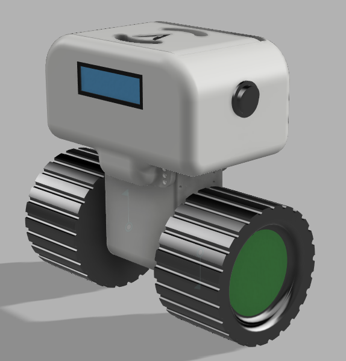 | 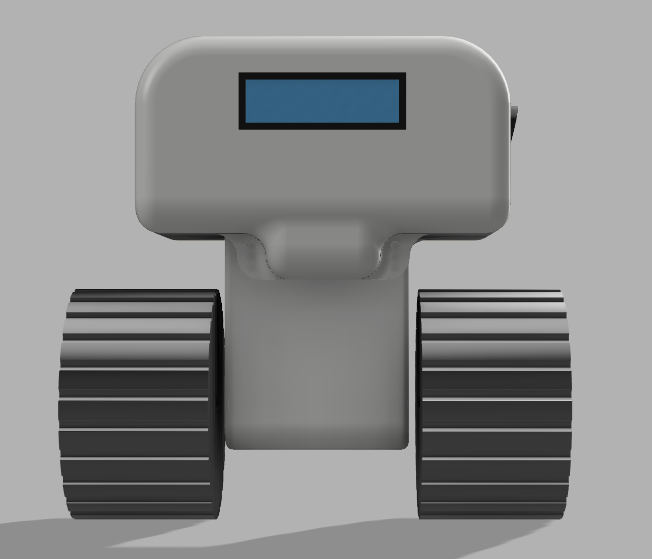 |
| 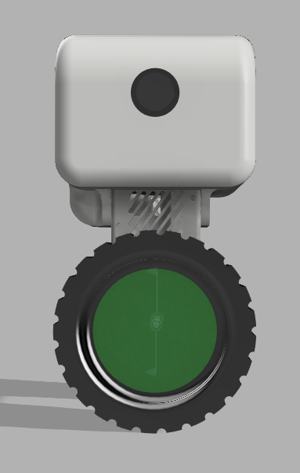 | 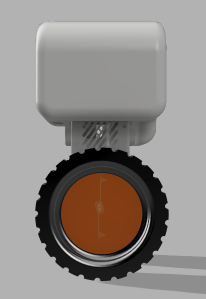 |
| 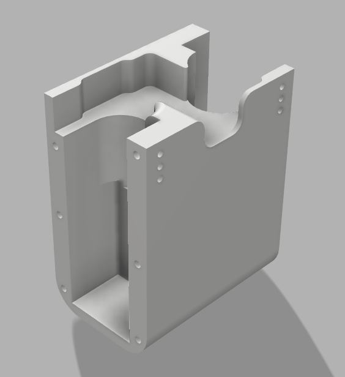 | 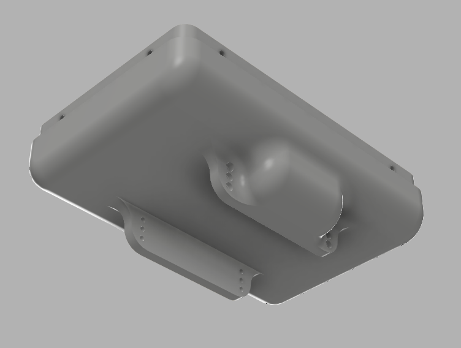 |
| 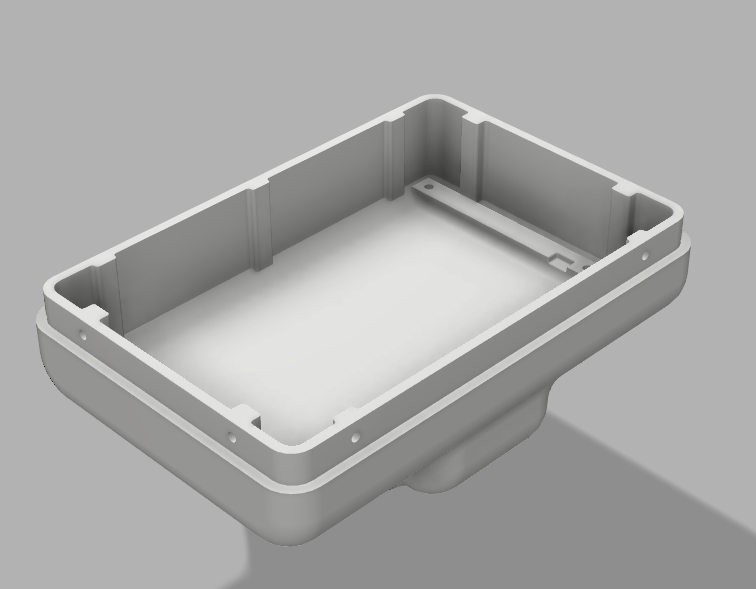 | 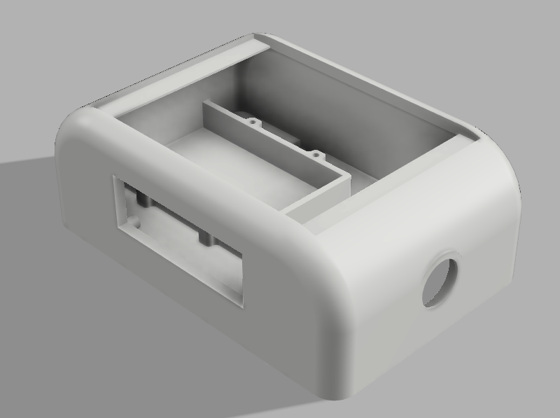 |

##### PCB-design

| | |
| :---: | :---: |
| 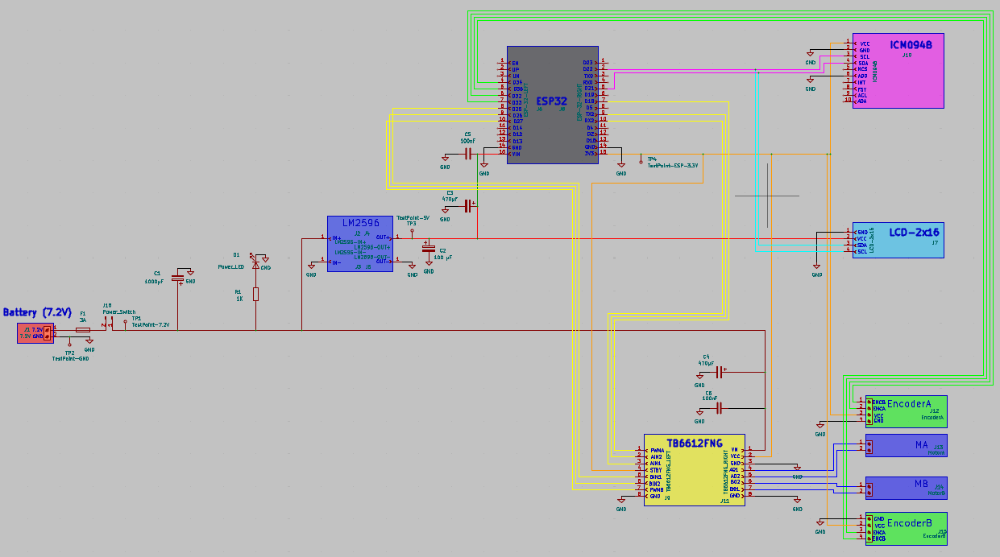 | 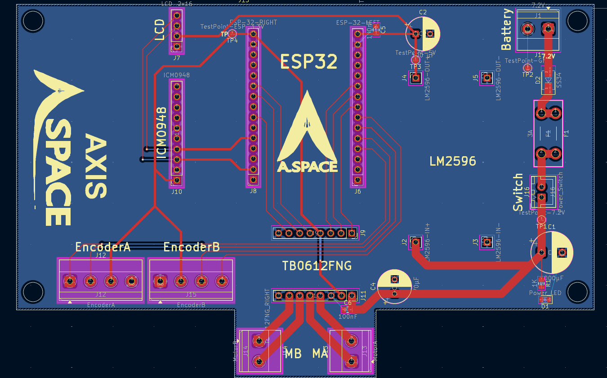 |
| 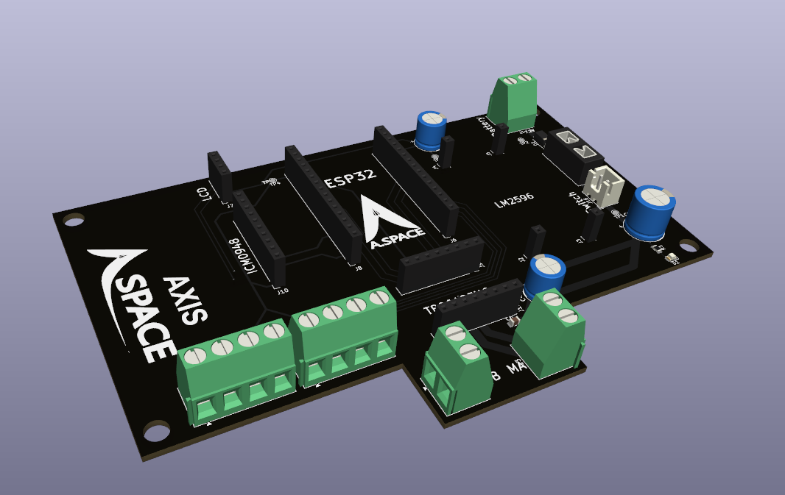 | |

